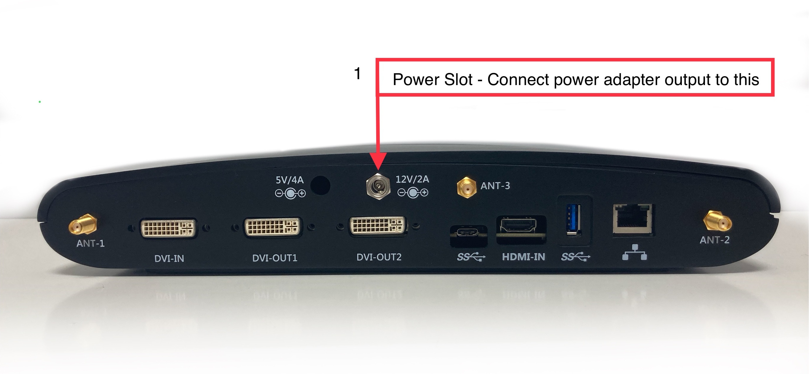
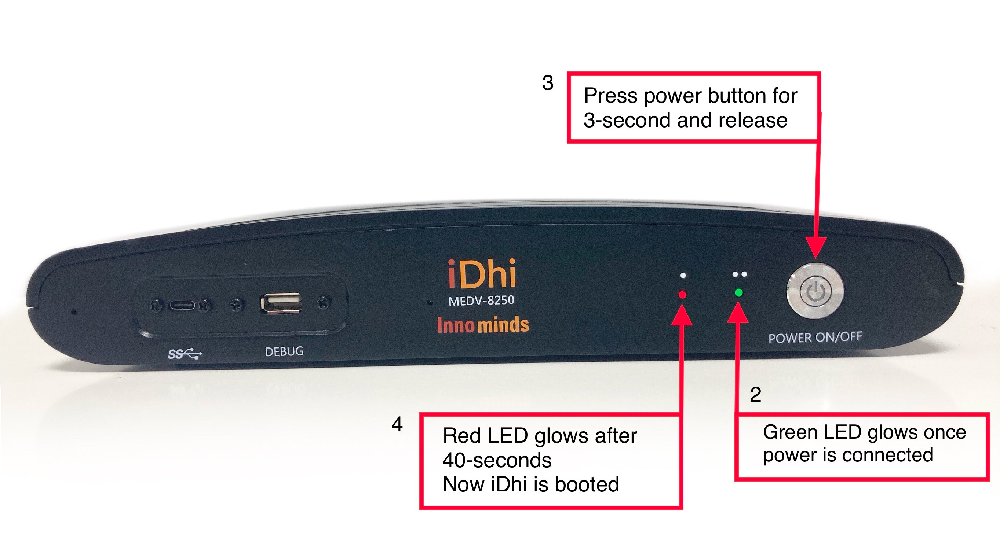

# Getting Started with iDhi

-   [Introduction](#Introduction)
-   [Step 1: Prerequisites](#Prerequisites)
-   [Step 2: Prepare your Device](#Prepareyourdevice)
-   [Step 3: Build SDK and Run Samples](#Build)

# Introduction
**About this document**
This document describes how to connect iDhi device running Android-10 with Azure IoT Java SDK. This multi-step process includes:

-   Configuring Azure IoT Hub
-   Registering your IoT device
-   Provisioning your devices on Device Provisioning service 
-   Build and deploy Azure IoT SDK on device
-   Please provide introduction and features of your device here

# Step 1: Prerequisites

You should have the following items ready before beginning the process:

-   Prepare your development environment
      iDhi is Android-10 based device.  Using Azure Java Device SDK is the natural choice to develop Azure IoT Hub Device Client for iDhi.  Azure Java Device SDK is used along with Android development environment, which is based on Android Studio.  

      To start, you should [download and install](https://developer.android.com/studio/install) Android Studio.  
      
      You can validate your development environment installation using  [Azure IoT SDKs for Java](https://github.com/Azure/azure-iot-sdk-java/blob/main/doc/java-devbox-setup.md#building-for-android-device) documentation.
-   [Setup your IoT hub](https://github.com/robertalorro/azure-iot-device-ecosystem/blob/master/setup_iothub.md)
-   [Provision your device over DPS](https://docs.microsoft.com/en-us/azure/iot-dps/about-iot-dps)

# Step 2: Prepare your Device

-    Setup the device and connect power.
      iDhi comes with its own power-adapter.  (iDhi needs a 12V/2A output rated adapter.)  Use the 12V power-slot (marked on the back-panel) to connect the power adapter.  
      
      

      

      The Power-Connected indicatore Green-LED on the front panel should start glowing.  Press and hold the Power button on the front panel for 3-seconds.  The Boot-Complete Red-LED on the front panel comes up in about 40-seconds.  

      [comment]: <> (TODO: put a back panel, adapter and connection picture here.  Put a picture showing the power switch.  Put a picture showing the front panel LED.  Is there a boot indication.  Record wait times for boot completion and adb device detection.)

      Use the Type-C USB slot on the front panel to connect iDhi to your development system.   Android Studio should detect the connected iDhi device.

     [comment]: <> (TODO: Picture of front-panel USB slot.  Picture of detected device in Android Studio.)

-    Take the DPS configuration and program the device 
-    
    The DPS configuration is at <code>/data/dps.conf</code>.   You can use <code>adb</code> to update this file.  A sample of the <code>dps.conf</code> is provided [here](conf/dps.conf)  

     [comment]: <> (TODO: check dps link works ok.)

     You can make a copy of this <code>dps.conf</code> and update it with values appropriate for your device.

     Use a terminal, and launch <code>adb</code> and push your <code>dps.conf</code> to the <code>/data</code> directory in iDhi.
     
      adb push dps.conf /data

-    To connect iDhi device over Wifi.

     [comment]: <> (following text has to modified for HDMI and touch panel.  Put touch panel module info).

     iDhi is a Android based device.  But then, it does not have screen.  You can use an Android screen-casting app like [Vysor](https://www.vysor.io/)  or [scrcpy](https://github.com/Genymobile/scrcpy) to see the screen on your development host.   Once the iDhi screen is casted to the host, you can use steps similar to any Android device to configure and connect to Wifi.  
     
     [comment]: <> (check with shalini ^^^ regarding screen)
     
     [comment]: <> (insert screen capture to show connecting to Wifi.)

     [comment]: <> (Add that cellular can be provided on request -- put cellular module info.)

# Step 3 : Build SDK and Run Samples

  The Azure Device Client code for connection to Azure IoT Hub is given [here](https://github.com/tpsara/iDhi).  This can be build using Android Studio.   Standard steps to Build Android apps will suffice.  Once build, the app can be installed from the terminal.
  
      adb install idhi-device-client.apk
     
  [comment]: <> (put some screen shots of Android-Studio, and terminal usage)
     
  Reboot iDhi.
  
      adb reboot 
      
  Wait for the boot complete Red-LED on the front panel to come up.
  
  Now onwards the device will connect to Azure IoT Hub when it powers up.
   
   
     

