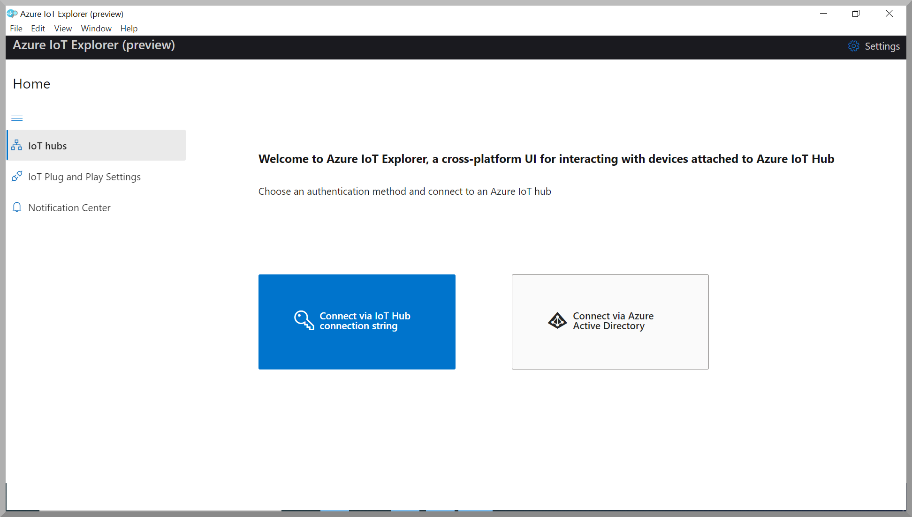
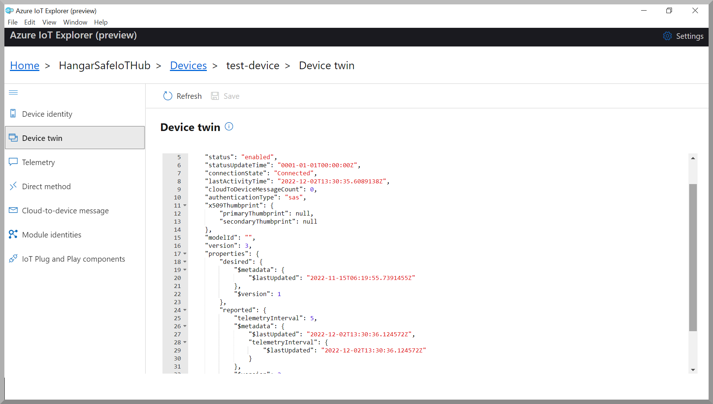
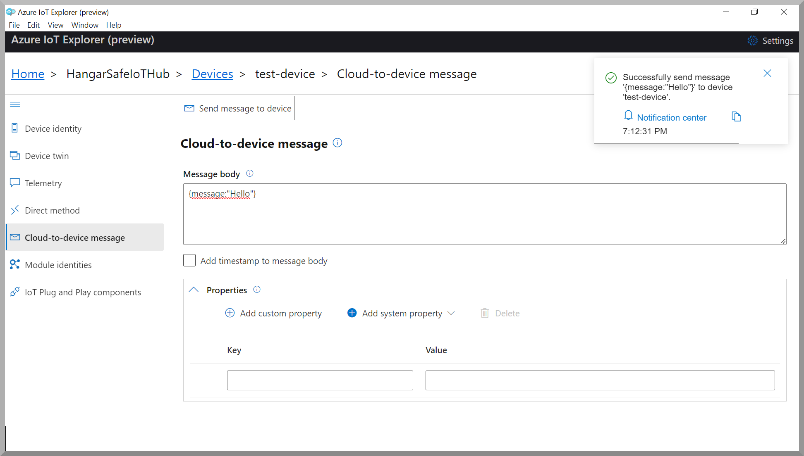

# Getting Started with iDhi

-   [Introduction](#Introduction)
-   [Step 1: Prerequisites](#Prerequisites)
-   [Step 2: Prepare your Device](#Prepareyourdevice)
-   [Step 3: Build SDK and Run Sample code for connecting to Azure IoT Hub](#Build)
-   [Step 4: Integration with Azure IoT Explorer](#IntegrationWithAzureIotExplorer)

# Introduction

**About this document**

This document describes how to connect iDhi device running Android-10 with Azure IoT Java SDK. This multi-step process includes:

-   Configuring Azure IoT Hub
-   Registering iDhi
-   Provisioning iDhi on Device Provisioning Service 
-   Build and deploy Azure IoT SDK on device

# Step 1: Prerequisites

You should have the following items ready before beginning the process:

-   Prepare your development environment

      iDhi is Android-10 based device.  Using Azure Java Device SDK is the natural choice to develop Azure IoT Hub Device Client for iDhi.  Azure Java Device SDK is used along with Android development environment, which is based on Android Studio.  

      To start, you should [download and install](https://developer.android.com/studio/install) Android Studio.  
      
      You can validate your development environment installation using  [Azure IoT SDKs for Java](https://github.com/Azure/azure-iot-sdk-java/blob/main/doc/java-devbox-setup.md#building-for-android-device) documentation.
-   [Setup your IoT hub](https://github.com/robertalorro/azure-iot-device-ecosystem/blob/master/setup_iothub.md)
-   [Provision your device over DPS](https://docs.microsoft.com/en-us/azure/iot-dps/about-iot-dps)

# Step 2: Prepare iDhi

-    Setup the device and connect power.

      iDhi comes with its own power-adapter.  (iDhi needs a 12V/2A output rated adapter.)  Use the 12V power-slot (marked on the back-panel) to connect the power adapter.  
      
      

      

      The Power-Connected indicator Green-LED on the front panel should start glowing.  Press and hold the Power button on the front panel for 3-seconds.  The Boot-Complete Red-LED on the front panel comes up in about 40-seconds.  

      [comment]: <> (TODO: put a back panel, adapter and connection picture here.  Put a picture showing the power switch.  Put a picture showing the front panel LED.  Is there a boot indication.  Record wait times for boot completion and adb device detection.)

      Use the Type-C USB slot on the front panel to connect iDhi to your development system.   Android Studio should detect the connected iDhi device (iDhi comes up as 'Qualcomm Kona for arm64').

     [comment]: <> (TODO: Picture of front-panel USB slot.  Picture of detected device in Android Studio.)

-    Take the DPS configuration and program the device 
-    
    The DPS configuration is at <code>/data/dps.conf</code> on the device.   You can use <code>adb</code> to update this file.  A sample of the <code>dps.conf</code> is provided [here](conf/dps.conf)  

     [comment]: <> (TODO: check dps link works ok.)

     You can make a copy of this <code>dps.conf</code> and update it with values appropriate for your device.

     Use a terminal, and launch <code>adb</code> and push your <code>dps.conf</code> to the <code>/data</code> directory in iDhi.
     
      adb push dps.conf /data

     The information in <code>dps.conf</code> files is used by the iDhi Device Client to provision the device in the Azure IoT Hub identified in <code>dps.conf</code>.  Please make sure the <code>dps.conf</code> information is accurate, otherwise the device will not get provisioned.

-    To connect iDhi device over Wifi.

     [comment]: <> (following text has to modified for HDMI and touch panel.  Put touch panel module info.)

     iDhi does not have a built-in display.  You can use an Android screen-casting app like [Vysor](https://www.vysor.io/)  or [scrcpy](https://github.com/Genymobile/scrcpy) to see the display on your development host.   Once the iDhi display is casted to the host, you can use steps similar to any Android device to configure and connect to Wifi.  
     
     [comment]: <> (check with shalini ^^^ regarding screen)
     
     [comment]: <> (insert screen capture to show connecting to Wifi.)

     [comment]: <> (Add that cellular can be provided on request -- put cellular module info.)

# Step 3 : Build SDK and Run Sample code for connecting to Azure IoT Hub

  The Azure Device Client code for connection to Azure IoT Hub is given [here](https://github.com/tpsara/iDhi).  This can be built using Android Studio.   Standard steps to build Android apps will suffice.  Once built, the app can be installed from the terminal.
  
      adb install idhi-device-client.apk
     
  [comment]: <> (put some screen shots of Android-Studio, and terminal usage)
     
  Reboot iDhi.
  
      adb reboot 
      
  Wait for the boot complete Red-LED on the front panel to come up.  Now onwards the device will connect to Azure IoT Hub when it powers up.   Such a connected device can be viewed and controlled using Azure IoT Explorer, and this is explained in the section ahead.

      
# Step 4 : Integration with Azure IoT Explorer

   The Azure IoT explorer is a graphical tool for interacting with devices connected to Azure IoT Hub.   Users can use Azure IoT Explorer and exercise the communication between iDhi device and Azure IoT Hub.
   
   Following are the steps to interact with a connected iDhi device using Azure IoT explorer.

   - Download and Install Azure IoT Explorer.  For details refer [here](https://learn.microsoft.com/en-us/azure/iot-fundamentals/howto-use-iot-explorer).
   - Launch the Azure IoT Explorer      

     
     
   - Use <code>Connect via IoT Hub connection string</code> button then use <code>Add connection</code> option and save the connection string of the hub to which you want to connect the iDhi test device. For details on how to get Azure IoT Hub connection string click on <code>Where do I get an IoT hub connection String?</code> documentation link provided in the IoT Explorer <code>Add connection string</code> screen (which comes up when you have clicked the <code>Add connection</code> option).
   
   - Select the iDhi device which you want to test.  In the following example we assume that the iDhi device under test is named <code>test-device</code>.     Now, we assume that you have selected <code>test-device</code> from the list of devices, to try out Azure IoT Explorer integration.

   - Now you can choose <code>Device twin</code> on the left-panel to view the details of the device twin.

   

   - You can also test the invocation of Direct Method by choosing <code>Direct method</code> on the left-panel.
     Refer screenshot below for Mehod name and Payload invocation details. Then click <code>Invoke method</code> button. The response for the Invoke method is displayed as pop-up message on the top right corner as shown in screenshot below.

   

   - You can also test the cloud to device communication by choosing <code>Cloud-to-device message</code> on the left-panel.
     Construct the Message body in JSON format and click <code>Send message to device</code> button.  You can see the response is displayed as a pop-up message on the top right corner as shown in screenshot below.
     
        
